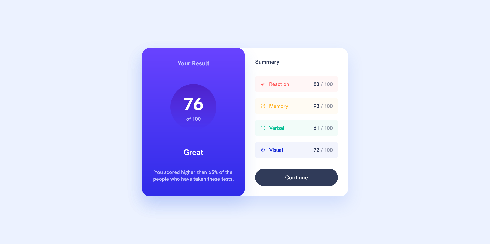

# Frontend Mentor - Results summary component solution

This is a solution to the [Results summary component challenge on Frontend Mentor](https://www.frontendmentor.io/challenges/results-summary-component-CE_K6s0maV). Frontend Mentor challenges help you improve your coding skills by building realistic projects. 

## Table of contents

- [Overview](#overview)
  - [The challenge](#the-challenge)
  - [Screenshot](#screenshot)
  - [Links](#links)
- [My process](#my-process)
  - [Built with](#built-with)
  - [What I learned](#what-i-learned)
- [Author](#author)

## Overview

### The challenge

Users should be able to:

- View the optimal layout for the interface depending on their device's screen size
- See hover and focus states for all interactive elements on the page

### Screenshot

### Links

- Solution URL: [Add solution URL here](https://your-solution-url.com)
- Live Site URL: [https://results-summary-component-main-psi-two.vercel.app](https://results-summary-component-main-psi-two.vercel.app)

## My process

### Built with

- Semantic HTML5 markup
- CSS custom properties
- Flexbox
- Mobile-first workflow
- [BEM](https://en.bem.info/methodology/css/) - CSS Methodology
- [Sass](https://sass-lang.com) - CSS Pre-processor
- [React](https://reactjs.org/) - JS library

### What I learned

This challenge was great to pratice my skills envolving responsiveness, css flexbox and componentization with react.

## Author

- Frontend Mentor - [@jAllanOli](https://www.frontendmentor.io/profile/jAllanOli)
